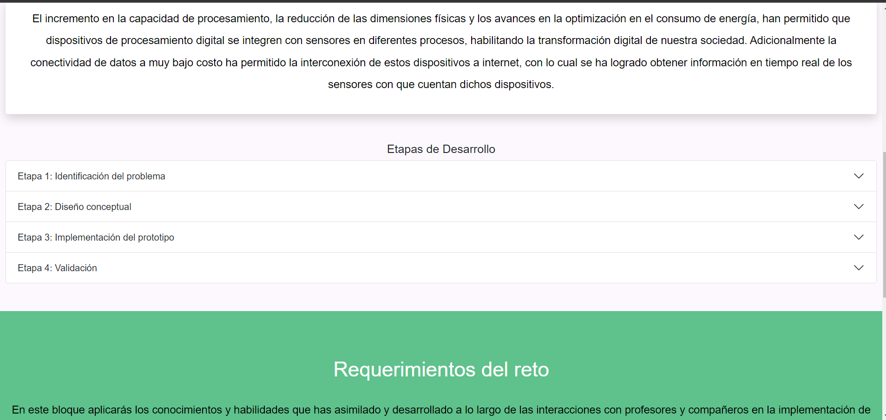

#    IOT Final Project

## Description
This project was part of the course "Internet of Things Implementation" where I was asked to develop a web platform capable of displaying and querying data from a SQL database that is constantly adding information from an Arduino that has sensors. With this platform we can keep informed about the state of the environment, so that if the data varies too much, we can know that something is wrong with the environment.

## Main Learnings 
* SQL Language
* HTML/CSS
* PHP
* Teamwork
* Pair programming 
* Arduino Language

## Installation
* Make sure to have 

## Screenshots
 
 
 
 
